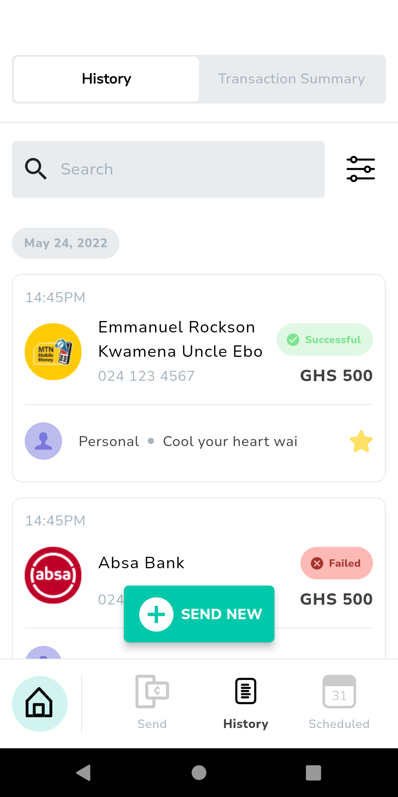

# Hubtel Coding Challenge - Flutter App

Welcome, this project was built with Flutter! 

## Overview
This a one screen coding challenge by hubtel in other to evaluate my coding skills in flutter

## Requirements
- Flutter SDK
- Dart SDK
- Other dependencies mentioned in `pubspec.yaml`

## Links
- [GitHub Repository](https://github.com/Qweku/hubtel_coding_challenge)

## Screenshots

| Sample Page |  
|------|
|  | 

## Major Packages
- `sizer: ^x.x.x`
- `flutter_svg: ^x.x.x`
- Other packages as listed in `pubspec.yaml`

## Author
- [Collins Brobbey Jnr](https://github.com/Qweku)
